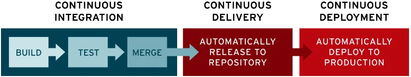

# Definition

Ce sont des pratiques DevOps, qui désigne l'intégration et la distribution ou le déploiement continu.

Cela a pour objectif de rationaliser et d'accélérer le cycle de vie de développement des logiciels.

 

Ce processus ont pour but de faire gagner du temps aux développeurs dans leur travail en automatisant un maximum de processus, tout en en garantissant une meilleure robustesse et maintenabilité du code.
