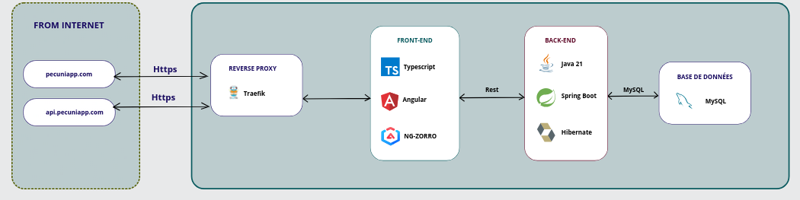

# Docker Compose sur le serveur

Après avoir configurer notre serveur, on doit configurer les éléments restants pour le déploiement de notre application en couche.

Comme nous utilisons Docker pour la containeurisation de nos applications pour le déploiement, nous avons besoin d'un orchestrateur de containeur.
Nous avons choisis d'utiliser **docker compose** par sa simplicité d'utilisation.

 

## Le docker compose de deploiement

Afin d'orchestrer nos containers, nous avons plusieurs services dans notre fichier.

Tout d'abord, nous avons choisi une image d'un reverse proxy comme Traefik, qui nous permet à la fois de rediriger correctement les requetes entre nos services et aussi d'avoir des certificats SSL automatiquement et gratuitement. 

```yaml
services:
  traefik:
    image: traefik:v3.4
    container_name: traefik
    restart: unless-stopped
    command:
      - "--api.insecure=true"
      - "--providers.docker.true"
      - "--providers.docker.exposedbyDefault=false"
      - "--entryPoints.web.address=:80"
      - "--entryPoints.websecure.address=:443"
      - "--certificatesresolvers.myresolver.acme.httpchallenge=true"
      - "--certificatesresolvers.myresolver.acme.httpchallenge.entrypoint=web"
      - "--certificatesresolvers.myresolver.acme.email=mysubscriptions@tuta.com"
      "--certificatesresolvers.myresolver.acme.storage=/letsencrypt/acme.json"
    ports:
      - "80:80"
      - "443:443"
      - "8080:8080"
    volumes:
      - "./letsencrypt:/letsencrypt
      - "/var/run/docker.sock:/var/run/docker.sock:ro"
```

De plus la configuration est simple. On configure Traefik directement dans le fichier afin de rediriger les requêtes http et https vers notre nom de domaine que nous verrons dans nos services de l'application


```yaml
 frontend:
  image: txrigxn/pecunia-front:latest
  container_name: pecunia-front
  env_file: ".env"
  labels:
    - "traefik.enable=true"
    - "traefik.http.routers.frontend.rule=Host(`pecuniapp.com`)"
    - "traefik.http.routers.frontend.entrypoints=websecure"
    - "traefik.http.routers.frontend.tls.certresolver=myresolver"

```

Le reverse proxy est configuré pour rediriger les requêtes venu de `pecuniapp.com` vers notre application frontend, qui ensuite lui appelera notre api.

```yaml
 backend:
  image: txrigxn/pecunia-api:latest
  container_name: "pecunia-api"
  ports:
    - ${SPRING_LOCAL_PORT}:${SPRING_DOCKER_PORT}
  env_file: ".env"
  volumes:
    - ./src/:/app/src
  depends_on:
    db:
      condition: service_healthy
  labels:
  - "traefik.enable=true"
  - "traefik.http.routers.backend.rule=Host(`api.pecuniapp.com`)"
  - "traefik.http.routers.backend.entrypoints=websecure"
  - "traefik.http.routers.backend.tls.certificatesresolvers=myresolver"
```

Après notre service front, le backend est mis en place aussi avec l'utilisation du protocole `https` avec le sous-domaine `api.pecuniapp.com` mais cette api est privé.

Enfin, comme le service *backend* dépend de la bonne condition de notre base de donnée avec la ligne `depends_on`, on ajouter un nouveau service :

```yaml
  db:
    image: mysql:8
    restart: always
    ports:
      - ${DB_LOCAL_PORT}:${DB_DOCKER_PORT}
    env_file: ".env"
    healthcheck:
      test: ["CMD", "mysqladmin", "ping", "-h", "localhost"]
      interval: 10s
      timeout: 5s
      retries: 20
    volumes:
    - db_data:/var/lib/mysql

volumes:
  db_data:
```

Un volume est créé pour l'image mysql officiel pour que les données enregistrer via l'api soit persistant pour les utilisateurs.
