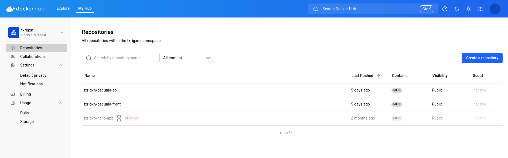

# Workflow de mise en ligne

A nos workflows précédents, on va créer un nouveau workflow sous certaines conditions.

```yaml
on:
  workflow_run:
    workflows: ["CI - Build and Test"]
    types:
      - completed

jobs:
  deploy:
    if: |
      github.event.workflow_run.conclusion == 'success' &&
      github.event.workflow_run.head_branch == 'main'
```
D'après les conditions définies dans la section **on** de ce fichier, on voit que le workflow chargé de lancer le déploiement se déclenche **quand le workflow "CI- Build and Test" est terminé.
De plus, dans la section **jobs** on va rajouter deux conditions afin de d'être plus granulaire dans notre workflow.
On va vouloir que notre **workflow** de la CI soit au vert et qu'il se soit passé sur main ou dev (suivant l'environnement où vous êtes)


## Les Images sur DockerHub

A notre fichier précédent, on va rajouter une étape pour créer une image Docker et la pousser en ligne sur DockerHub.

```yaml
      - name: Log in Docker Hub
        uses: docker/login-action@v3
        with:
          username: ${{ secrets.DOCKERHUB_USERNAME }}
          password: ${{ secrets.DOCKERHUB_PASSWORD }}
      - name: Build and Push Docker Image
        run: |
          docker build -t txrigxn/pecunia-api:latest . || exit 1
          docker push txrigxn/pecunia-api:latest
```

De facon synthetique, cette étape permet de créer une image docker du code récupérer sur le dépôt, de se connecter à DockerHub et de pousser le tout en ligne.

Avec cette étape, on remarque que les images sont poussées vers notre profil DockerHub: 

 

## Se connecter au Serveur

On va rajouter une étape à notre fichier afin de se connecter en Ssh à notre serveur distant pour exécuter un script de déploiement.

```yaml
      - name: Deploy to Server
        env:
          SSHKEY: ${{ secrets.SSHKEY }}
          VPS_USER: ${{ secrets.VPS_USER }}
          VPS_HOST: ${{ secrets.VPS_HOST }}
          SSH_KNOWN_HOSTS: ${{ secrets.SSH_KNOWN_HOSTS }}
        run: |
          # SSH KEY CONFIG
          mkdir -p ~/.ssh
          echo "$SSHKEY" > ~/.ssh/id_ed25519
          chmod 600 ~/.ssh/id_ed25519
          echo "$SSH_KNOWN_HOSTS" > ~/.ssh/known_hosts
          ssh -i ~/.ssh/id_ed25519 ${VPS_USER}@${VPS_HOST} "/home/pecunia/pecunia/deploy.sh"
```

Cette étape permet :
- de configurer temporairement la clée SSH et les hôtes connus,
- de se connecter automatiquement au serveur via SSH
- et d'exécuter un script `deploy.sh` situé sur le serveur pour lancer pour le déploiement de l'application

Grâce à cette automatisation, le déploiement se fait directement après la construction ou la mise à jour de l'image, sans intervention manuelle.


