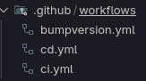

# La pipeline CI

Pour mettre en place une CI côté [backend](./backend/backend.md) ou [frontend](./frontend.md), on commence par créer un ficher de **workflows** qui seront automatiquement reconnu par Github.

 

On va y définir un **workflow** chargé de lancer tous les tests du bakcend ou du frontend.
