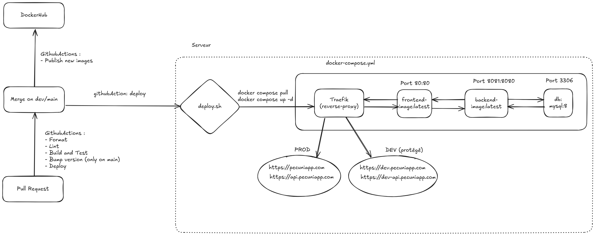

# Récapitulatif du fonctionnement de la CI / CD

**La CI** permet d'automatiser l'éxecution de tests lors de l'ajout de code sur le dépôt distant commun, afin de détecter immédiatement des problèmes d'intégrations.

**La CD** permet d'automatiser la mise en ligne et mise à jour du projet lorsque du code est ajouté sur le dépôt distant commun, afin d'apporter régulièrement des modifications en production fiable.

Ces deux concepts DevOps utilisent **l'automatisation des tâches**, pour permettre des processus fluides et rapides.

Concernant Pecunia, un schéma récapitulatif de tout le processus CI / CD est disponible ci-dessous :

 
