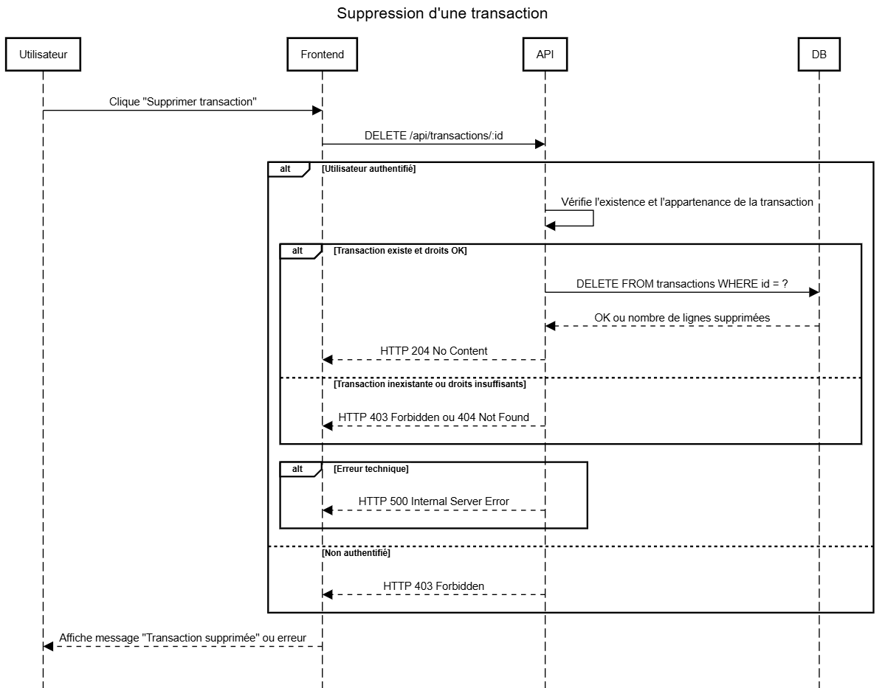

# Conception de BDD + UML : 

* * *

## MLD + MODÈLE PHYSIQUE DE DONNÉES  + Diagramme de classe + Diagramme séquence : 

Drawio : [https://app.diagrams.net/?src=about#G1yuIcwr5naRDbpJvKWywAGntifsswMZHg#%7B%22pageId%22%3A%22-F2r\_zDhWsfIRe05eEPR%22%7D](https://app.diagrams.net/?src=about#G1yuIcwr5naRDbpJvKWywAGntifsswMZHg#%7B%22pageId%22%3A%22-F2r_zDhWsfIRe05eEPR%22%7D)

### Diagramme de cas d'usage :

LucidChart : [https://lucid.app/lucidchart/c0417efa-c71c-479d-9d3f-c88048240679/edit?viewport\_loc=-266%2C901%2C416%2C205%2C.Q4MUjXso07N&invitationId=inv\_b4b420aa-d55a-4500-b1de-c1563b326c42](https://lucid.app/lucidchart/c0417efa-c71c-479d-9d3f-c88048240679/edit?viewport_loc=-266%2C901%2C416%2C205%2C.Q4MUjXso07N&invitationId=inv_b4b420aa-d55a-4500-b1de-c1563b326c42)

 

* * *

### Dictionnaire de données :

Google sheets : [https://docs.google.com/spreadsheets/d/1p\_G5ZhDzxSyXcsKZC1ZgbwwwVrPcOlQ\_fioW7h5U2kQ/edit?gid=0#gid=0](https://docs.google.com/spreadsheets/d/1p_G5ZhDzxSyXcsKZC1ZgbwwwVrPcOlQ_fioW7h5U2kQ/edit?gid=0#gid=0)

* * *

### MODÈLE CONCEPTUEL DE DONNÉES :

Début de MCD : [lien](https://media-protected.taiga.io/attachments/e/3/1/b/b69b9072ac9a9caa24b21746f17b0cad8d81325e4b145014594050346848/brainsto-bdd.png?token=aG-RnA%3AVukLZBHXZFSZ5g7fuUk6W5nCx1ODTOKQr77N3f8LsdxZihvdJlJgA_zKBVO3Ip1WzyyCDtkf-3T7Tz4EETa8Rg#_taiga-refresh=wikipage:3605769)


```markdown
// MOOCODO MCD

UTILISATEUR: email_utilisateur, mot de passe, nom, prénom, photo de profil
APPARTENIR, 01 UTILISATEUR, 11 PORTEFEUILLE
PORTEFEUILLE: nom_portefeuille, devise, solde initia
COMPOSER, 0N PORTEFEUILLE, 11 TRANSACTION
FOURNISSEUR: nom

CREER, 1N UTILISATEUR, 1N CATEGORIE
CATEGORIE:nom_categorie, icone, couleur, type, est_global
REUTILISER, 1N PORTEFEUILLE, 0N CATEGORIE
TRANSACTION: montant, type, note, date de la transaction
ASSOCIER, 1N FOURNISSEUR, 01 TRANSACTION

:
RATTACHER, 11 CATEGORIE, 0N ICONE
COMPORTER, 0N CATEGORIE, 11 TRANSACTION
CONTENIR, 0N ETIQUETTE, 01 TRANSACTION
:

:
ICONE:nom_icone, url
:
ETIQUETTE: nom_etiquette
:
```


```plaintext
:
:
COMPOSER, 0N PORTEFEUILLE, 11 TRANSACTION
:
:
PORTEFEUILLE: nom_portefeuille, devise, solde initial
:
:
ASSOCIER, 0N FOURNISSEUR, 01 TRANSACTION
TRANSACTION: montant, type, note, date de la transaction
CONTENIR, 0N TAG, 0N TRANSACTION

APPARTENIR, 01 UTILISATEUR, 11 PORTEFEUILLE
UTILISATEUR: email_utilisateur, mot de passe, nom, prénom, photo de profil
CREER, 11 FOURNISSEUR, 0N UTILISATEUR
FOURNISSEUR: nom
:
TAG: nom_tag

:
MODIFIER, 0N UTILISATEUR, 11 CATEGORIE
CATEGORIE:nom_categorie, icone, couleur, type, est_global
COMPORTER, 0N CATEGORIE, 11 TRANSACTION
:
:

:
:
RATTACHER, 11 CATEGORIE, 0N ICONE
ICONE:nom_icone, url
:
:
```


:  
:  
CREATE, 11 PROVIDER, 0N USER  
PROVIDER: name  
ASSOCIATE, 0N PROVIDER, 01 TRANSACTION  
TAG: tag\_name

USER\_ROLE: name  
ATTACH, 11 USER, 01 USER\_ROLE  
USER: email, password, last\_name, first\_name, profile\_picture  
BELONG\_TO, 01 USER, 11 WALLET  
:  
CONTAIN, 0N TAG, 0N TRANSACTION

:  
:  
MODIFY, 0N USER, 11 CATEGORY  
WALLET: name, currency, initial\_balance  
COMPOSE, 0N WALLET, 11 TRANSACTION  
TRANSACTION: amount, type, note, transaction\_date

ICON: icon\_name, url  
LINK, 11 CATEGORY, 0N ICON  
CATEGORY: name, icon, color, type, is\_global  
INCLUDE, 0N CATEGORY, 11 TRANSACTION  
:  
:  
 


:  
:  
CREATE, 11 PROVIDER, 0N USER  
PROVIDER: name  
ASSOCIATE, 0N PROVIDER, 01 TRANSACTION  
TAG: tag\_name

USER\_ROLE: name  
ATTACH, 11 USER, 01 USER\_ROLE  
USER: email, password, last\_name, first\_name, 
BELONG\_TO, 01 USER, 11 WALLET  
:  
CONTAIN, 0N TAG, 0N TRANSACTION

PROFILE\_PICTURE: file, 
LOAD, 11 USER, 11 PROFILE\_PICTURE 
:  
:  
MODIFY, 0N USER, 11 CATEGORY  
WALLET: name, currency, initial\_balance  
COMPOSE, 0N WALLET, 11 TRANSACTION  
TRANSACTION: amount, type, note, transaction\_date

ICON: icon\_name, url  
LINK, 11 CATEGORY, 0N ICON  
CATEGORY: name, icon, color, type, is\_global  
INCLUDE, 0N CATEGORY, 11 TRANSACTION  
:  
:  
 

* * *

**MODÈLE LOGIQUE DE DONNÉES :**

CATEGORIE ( nom\_categorie, icone, couleur, type, est\_global, #nom\_icone )

CREER ( #email\_utilisateur, #nom\_categorie )

ICONE ( nom\_icone, url )

PORTEFEUILLE ( nom\_portefeuille, devise, solde\_initia, #email\_utilisateur )

REUTILISER ( #nom\_portefeuille, #nom\_categorie )

TRANSACTION ( montant, type, note, date\_de\_la\_transaction, #nom\_portefeuille, nom, #nom\_categorie, nom\_etiquette )

UTILISATEUR ( email\_utilisateur, mot\_de\_passe, nom, prénom, photo\_de\_profil )

### Diagramme de séquence :

Nous avons utilisé le site [sequencediagram](https://sequencediagram.org/)

Voici un CRUD pour les transactions avec les scripts pour la génération des diagrammes sur le site

#### Créer une transaction

##### diagramme:


---
##### script:

```
title Création d'une transaction

participant Utilisateur
participant Frontend
participant API
participant DB

Utilisateur->Frontend: Remplit formulaire "Nouvelle transaction"
Frontend->API: POST /api/transactions (montant, catégorie, date, etc.)

alt Utilisateur authentifié
    API->API: Vérifie la validité des données (contrôles métiers et format)
    alt Données valides et droits OK
        API->DB: INSERT INTO transactions (...)
        DB-->API: Retour nouvel ID
        API-->Frontend: HTTP 201 + transaction JSON
    else Données invalides
        API-->Frontend: HTTP 400 Bad Request + message d'erreur
    else Droits insuffisants
        API-->Frontend: HTTP 403 Forbidden
    else Erreur technique
        API-->Frontend: HTTP 500 Internal Server Error
    end
else Non authentifié
    API-->Frontend: HTTP 403 Forbidden
end

Frontend-->Utilisateur: Affiche message de confirmation ou erreur
```

---
#### Consulter la liste des transactions

##### diagramme:


---
##### script:

```
title Consultation de la liste des transactions

participant Utilisateur
participant Frontend
participant API
participant DB

Utilisateur->Frontend: Accède au dashboard
Frontend->API: GET /api/transactions (filtres éventuels)

alt Utilisateur authentifié
    API->API: Vérifie les droits d'accès (appartenance utilisateur)
    alt Droits OK
        API->DB: SELECT * FROM transactions WHERE user_id = ? [et filtres éventuels]
        DB-->API: Liste des transactions
        API-->Frontend: HTTP 200 + JSON (liste des transactions)
    else Droits insuffisants
        API-->Frontend: HTTP 403 Forbidden
    else Erreur technique
        API-->Frontend: HTTP 500 Internal Server Error
    end
else Non authentifié
    API-->Frontend: HTTP 403 Forbidden
end

Frontend-->Utilisateur: Affiche la liste ou message d'erreur

```

---
#### Consulter une transaction avec un id

##### diagramme:


---
##### script:

```
title Consultation d'une transaction par ID

participant Utilisateur
participant Frontend
participant API
participant DB

Utilisateur->Frontend: Accède à la page d'une transaction (id)
Frontend->API: GET /api/transactions/:id

alt Utilisateur authentifié
    API->API: Vérifie l'existence de la transaction et les droits d'accès
    alt Transaction existe et droits OK
        API->DB: SELECT * FROM transactions WHERE id = ?
        DB-->API: Données de la transaction
        API-->Frontend: HTTP 200 + JSON (transaction)
    else Transaction inexistante ou droits insuffisants
        API-->Frontend: HTTP 403 Forbidden ou 404 Not Found
    end
    alt Erreur technique
        API-->Frontend: HTTP 500 Internal Server Error
    end
else Non authentifié
    API-->Frontend: HTTP 403 Forbidden
end
Frontend-->Utilisateur: Affiche les détails ou message d'erreur

```

---
#### Modifier une transaction

##### diagramme:


---
##### script:

```
title Modification d'une transaction

participant Utilisateur
participant Frontend
participant API
participant DB

Utilisateur->Frontend: Ouvre formulaire d'édition (transaction id)
Frontend->API: PUT /api/transactions/:id (nouveaux champs)

alt Utilisateur authentifié
    API->API: Vérifie l'existence de la transaction et les droits d'accès
    alt Transaction existe et droits OK
        API->API: Valide les nouvelles données
        alt Données valides
            API->DB: UPDATE transactions SET ... WHERE id = ?
            DB-->API: OK ou nombre lignes modifiées
            API-->Frontend: HTTP 200 + transaction mise à jour
        else Données invalides
            API-->Frontend: HTTP 400 Bad Request + message d'erreur
        else Erreur technique
            API-->Frontend: HTTP 500 Internal Server Error
        end
    else Transaction inexistante ou droits insuffisants
        API-->Frontend: HTTP 403 Forbidden ou 404 Not Found
    end
else Non authentifié
    API-->Frontend: HTTP 403 Forbidden
end

Frontend-->Utilisateur: Affiche message de validation ou d’erreur

```

---
#### Supprimer une transaction

##### diagramme:



---
##### script:

```
title Suppression d'une transaction

participant Utilisateur
participant Frontend
participant API
participant DB

Utilisateur->Frontend: Clique "Supprimer transaction"
Frontend->API: DELETE /api/transactions/:id

alt Utilisateur authentifié
    API->API: Vérifie l'existence et l'appartenance de la transaction
    alt Transaction existe et droits OK
        API->DB: DELETE FROM transactions WHERE id = ?
        DB-->API: OK ou nombre de lignes supprimées
        API-->Frontend: HTTP 204 No Content
    else Transaction inexistante ou droits insuffisants
        API-->Frontend: HTTP 403 Forbidden ou 404 Not Found
    end
    alt Erreur technique
        API-->Frontend: HTTP 500 Internal Server Error
    end
else Non authentifié
    API-->Frontend: HTTP 403 Forbidden
end

Frontend-->Utilisateur: Affiche message "Transaction supprimée" ou erreur

```

---
