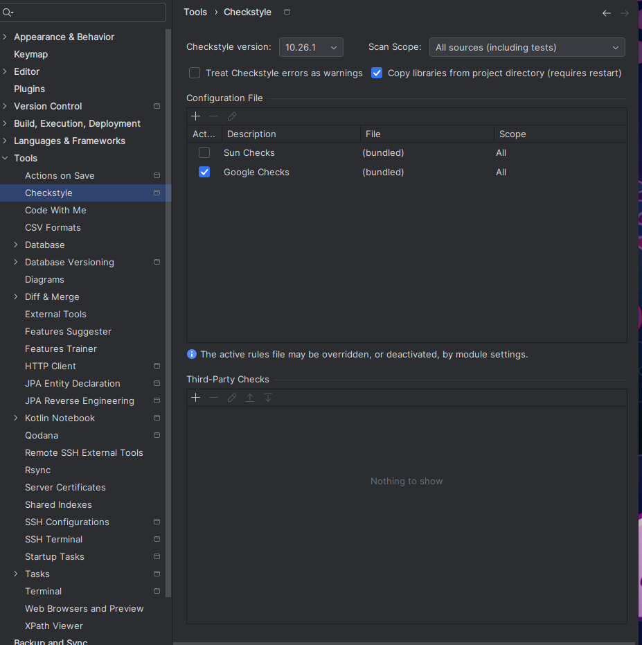
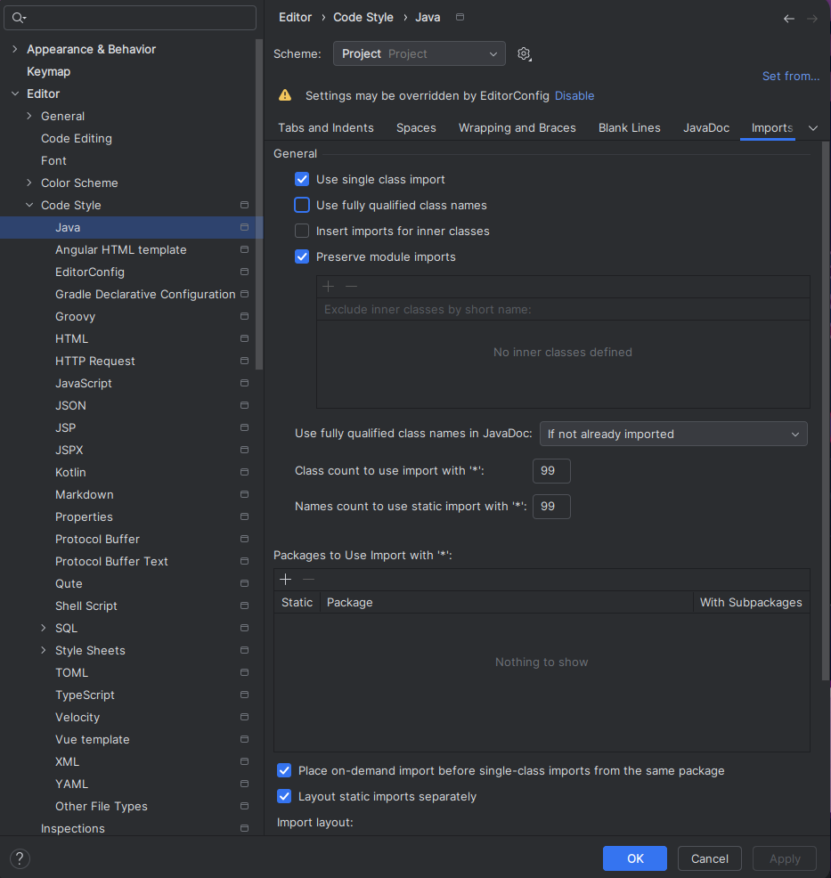
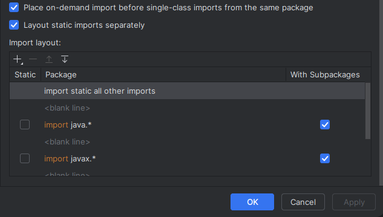
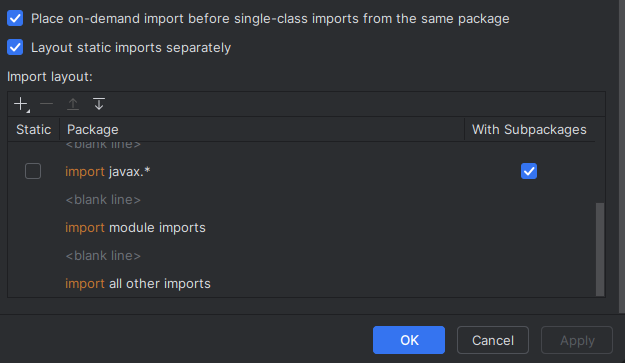
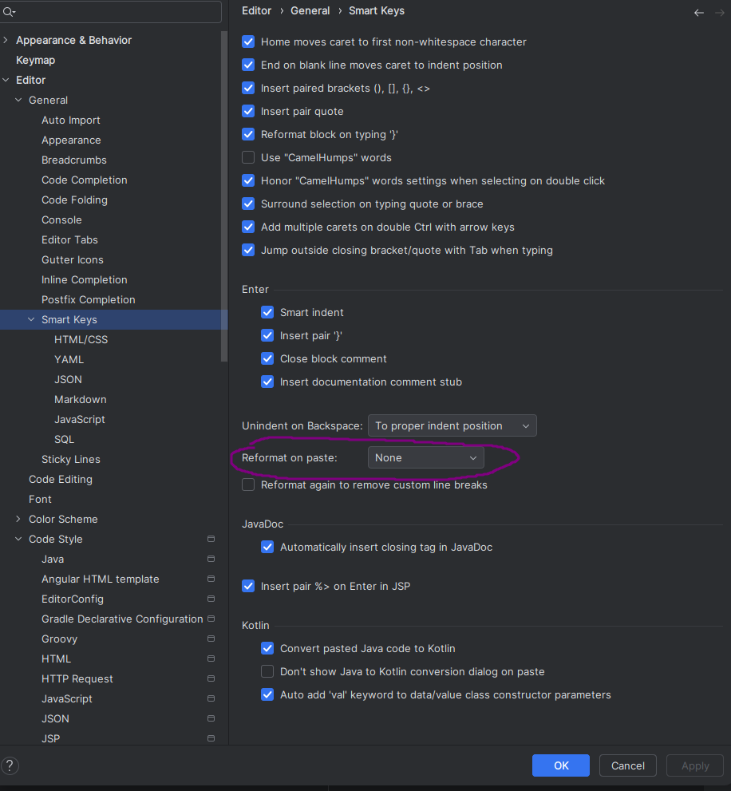

# Checkstyle

Checkstyle est un outil de développement qui permet d'avoir des standards de code en Java avec comme deux configurations par défaut: 

* `Sun Code Conventions` qui n'a plus été mis à jour depuis 1999
* `Google Java Style`dernière mis à jour en 2022 et qui est assez strict et ajout des standards d'indentation

C'est ce dernier que nous avons choisis pour notre projet.

### Installation Projet

> Checkstyle est présent dans notre projet grace à un plugin mis dans le `pom.xml` 

```xml
      <plugin>
        <groupId>org.apache.maven.plugins</groupId>
        <artifactId>maven-checkstyle-plugin</artifactId>
        <version>3.6.0</version>
        <configuration>
          <configLocation>google_checks.xml</configLocation>
          <consoleOutput>true</consoleOutput>
          <failsOnError>true</failsOnError>
          <linkXRef>false</linkXRef>
        </configuration>
        <executions>
          <execution>
            <id>validate</id>
            <phase>validate</phase>
            <goals>
              <goal>check</goal>
            </goals>
          </execution>
        </executions>
      </plugin>
```

Avec ce plugin maven, on pourra utiliser les commandes suivantes :        
 

* **mvn checkstyle:check**       
Cette comande anaylyse et va compter les violations directement dans la console. Cela peut faire échouer la compilation (ce qu'on veut ici)
* **mvn checkstyle:checkstyle**
* la meme chose qu'au dessus sauf qu'ici ca va générer un reporting en forme de page html avec toutes les violations du projet.On doit lancer à la main la page HTML qui se trouve dans target/site/checkstyle.html

Pour avoir ce dossier `site/` , il faut éxécuter la commande dans le terminal : 

`mvn site`   
 

### Extensions IDE

#### INTELIJ IDEA

Tout d'abord, on télécharge le plugin directement dans son IDE

Settings -> Plugins -> On clique sur `marketplace` -> On cherche "CheckStyle-IDEA"
On devrait retrouver ce [plugin](https://plugins.jetbrains.com/plugin/1065-checkstyle-idea)

Ensuite on va aller dans :
Settings -> Tools -> Checkstyle et on va cocher comme ci-dessous 

 


##### Organiser correctement les imports

Ensuite, on va modifier comment IDEA organise ses imports car on veut pas d'import en étoiles car ca peut porter à confusion avec d'autres packages quand une méthode à le même nom :

Encore une fois on va aller dans :

Settings -> Editor -> Code Style -> Java
Puis vous allez prendre cette configuration ci-dessous :


> [!WARNING]
> Il ne doit rien avoir dans la section "Packages to Use Import with '*'"

 
 

##### Désactiver l'auto indentation de IDEA

Settings -> General -> Smart Keys
Puis on utilise cette configuration :

 

Vous pouvez aussi utiliser ce tutorial si besoin : 

[https://checkstyle.org/idea.html](https://checkstyle.org/idea.html)

#### VS CODE

1. Installer l'extension [`Checkstyle For Java`](https://marketplace.visualstudio.com/items?itemName=shengchen.vscode-checkstyle)
2. `Ctrl+alt+P` => Checkstyle: Set the Checkstyle Configuration Style
3. Choisir `/google_checks.xml`
4. Normalement c'est bon, vous êtes en accord avec le projet

source : [https://github.com/redhat-developer/vscode-java/wiki/Formatter-settings](https://github.com/redhat-developer/vscode-java/wiki/Formatter-settings)
source: [https://checkstyle.org/](https://checkstyle.org/)
