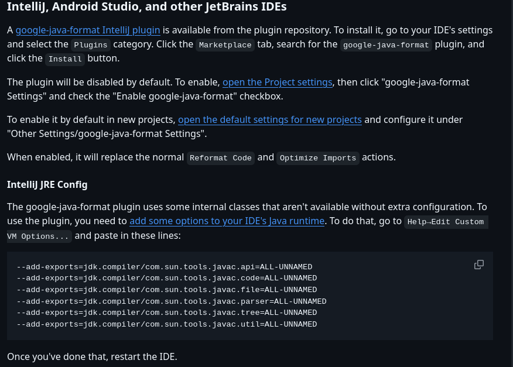
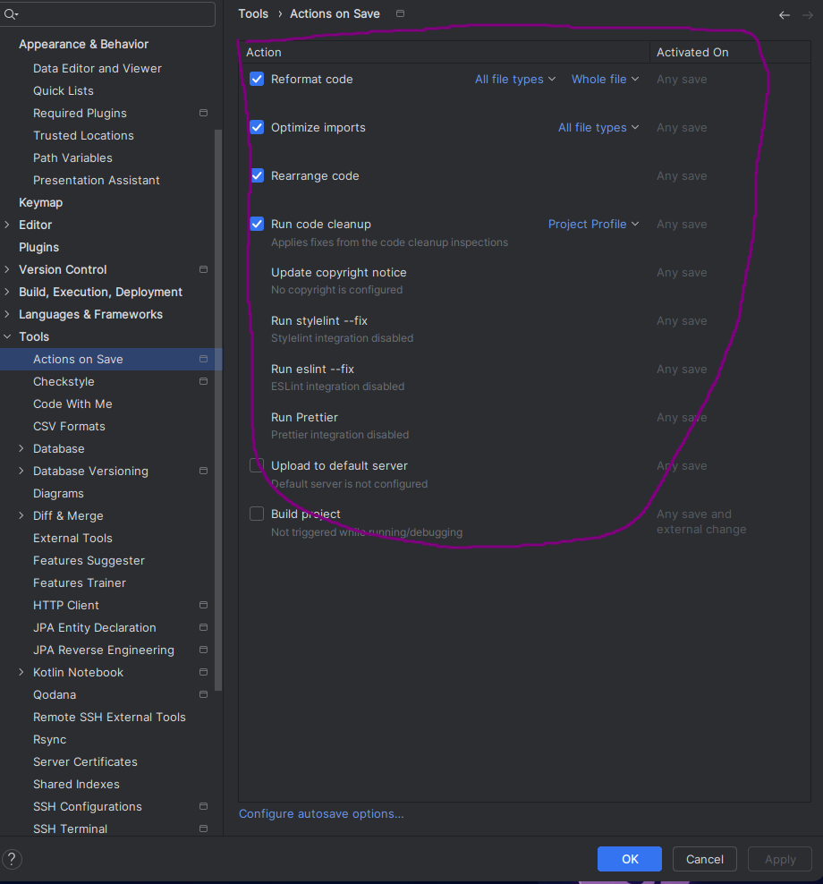

# Google Java Format

Afin de nous aider à satisfaire notre outil d'aide au développement qu'est [CheckStyle](./checkstyle.md), on va avoir besoin d'un formatteur qui va automatiser les conventions de code simple à mettre en place dans notre projet.

Avant de commencer le tutorial, je vous invite à lire le README de [Google Java Format](https://github.com/google/google-java-format).

## Installation IDE

### INTELIJ IDEA

Pour installer le formater, on va devoir installer un plugin :

Settings -> Plugins -> On clique sur `marketplace` -> On cherche "google-java-format"

On devrait retrouver ce [plugin](https://plugins.jetbrains.com/plugin/8527-google-java-format)

Ensuite vous avez juste à suivre cette partie dans le README du projet :

> [!WARNING]
>  Avant de passer à la suite je vous invite fortement à prendre cette config ci-dessous que vous retrouverez dans IDEA :
> Settings -> Tools -> Actions On Save

 
