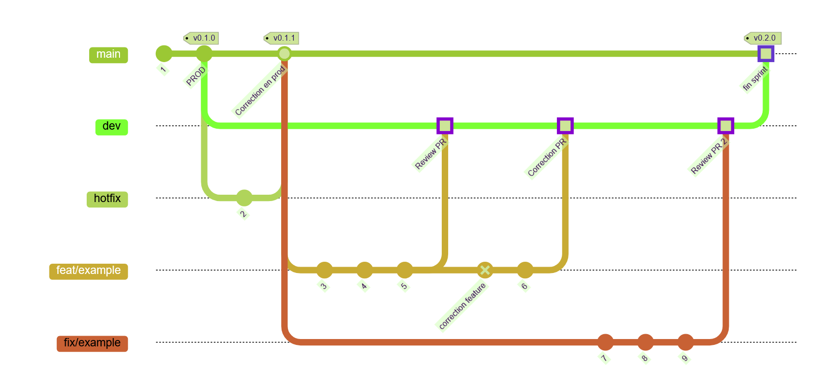

# 🔄 Workflow

## 1. Main Branch

- `main: Production-ready code`
- `dev: Integration branch for new features`

## 2. Feature workflow

- Create a branch : `git checkout -b feat/your-feature` from a `main` branch
- Push and open a pull request to dev
- Merge Rebase, if you can, only after 2 approval review

## Branching strategy schema

 

### Commit Messages Conventions

#### Why use a structured commit format ?

A clear and consistent commit message format improves readability, history tracking and automation (e.g., changelogs, release notes, etc)

#### Conventionnal commit format

`<type>(<scope>): <message>`

##### 🔷 Types of commits

| Type | Usages |
| :------: | :-----:|
| **feat** | A new feature. Correlates with MINOR in SemVer |
| **fix** | A bug fix. Correlates with PATCH in SemVer |
| **docs** | Documentation only changes |
| **test** | Adding missing or correcting existing tests |
| **build** | Changes that affect the build system or external dependencies (example scope: pip, docker, npm)
| **refactor** | A code change that neither fixes a bug nor adds a feature |
| **style** | Changes that do not affect the meaning of th code (white-space, formatting, missing semi-colons etc.) |
| **perf** | A code change that improves performance |
| **ci** | CI/CD related updates |

#### 📌 Examples

```git
feat(auth): add JWT authentication middlewares
fix(ui): resolve navbar rendering issue
build(angular): update angular17 to angular19
docs(readme): update installation guide
